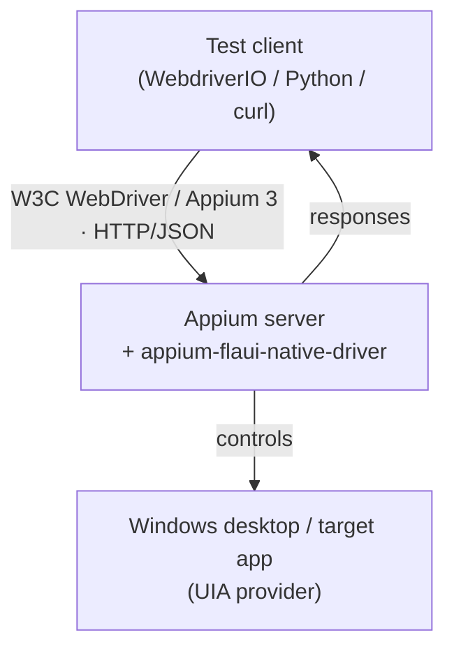
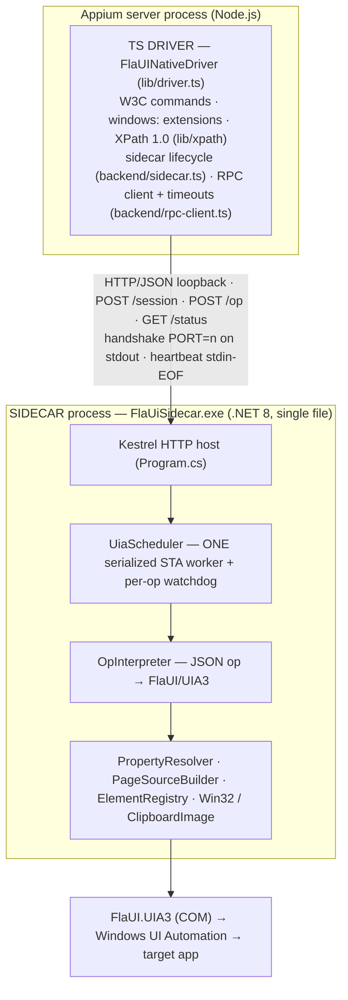

# Architecture Overview

*Architecture · updated 2026-06-04*

> **Layer:** high-level (C4 context + container). For the wire contract see
> [RPC protocol](../03-reference/rpc-protocol.md); for how one call is bounded against hangs see
> [stability](./stability.md); for the C# files see [sidecar internals](./sidecar-internals.md).

`appium-flaui-native-driver` is an **Appium 3 Windows UI-automation driver** built as two processes:
a **TypeScript Appium driver** that speaks the W3C WebDriver protocol to your test client, and a
compiled **C#/.NET 8 FlaUI sidecar** that does the actual UI Automation (UIA3) work. They talk over
**localhost HTTP with a structured-JSON RPC** — the "seam" is typed ops, never PowerShell strings
([ADR-003](../04-design/decisions.md)).

**Design priority:** stability > framework coverage > speed.

## C4 Level 1 — System context

The client sees a normal Appium driver. Everything below is internal to the driver package.

## C4 Level 2 — Containers

### Why two processes

UIA3 is a Windows COM API with no good Node binding; FlaUI (C#) is the mature, maintained client.
Isolating it in a sidecar means a frozen target app or a wedged COM call can be **bounded and killed
without taking down the Appium server** — the foundation of the stability story
([stability](./stability.md)). The structured-JSON seam (not PowerShell text) keeps the contract
typed and testable on both sides ([RPC protocol](../03-reference/rpc-protocol.md)).

## Container responsibilities

| Container | File(s) | Responsibility |
|---|---|---|
| Driver class | `lib/driver.ts` | W3C + `windows:` commands; capability parsing; maps commands → backend ops; session-health policy |
| XPath engine | `lib/xpath/*.ts` | XPath 1.0 (13 axes / 24 functions); pushes findable predicates to UIA, evaluates the rest in TS |
| Op contract | `lib/backend/ops.ts` | The seam: `BackendOp`, `Condition`, `BackendResult`, `W3CErrorType` |
| Sidecar lifecycle | `lib/backend/sidecar.ts` | Spawn exe, port handshake, health, exit tracking, graceful stop → SIGKILL |
| RPC client | `lib/backend/rpc-client.ts` | HTTP POST `/op`, per-op timeout, hard-deadline backstop, envelope unwrap |
| HTTP host | `sidecar/Program.cs` | `/status` `/session` `/op`; app-root resolution; idle/heartbeat guards; error→envelope map |
| Scheduler | `sidecar/UiaScheduler.cs` | One STA worker, per-op watchdog, poison-and-replace on freeze |
| Interpreter | `sidecar/OpInterpreter.cs` | Each op → FlaUI/UIA3 calls |
| Support | `PropertyResolver(+Logic)`, `PageSourceBuilder`, `ElementRegistry`, `Win32`, `ClipboardImage` | attributes, page source, element handles, native escapes |

## Request lifecycle (summary)

1. Client sends a W3C command → `FlaUINativeDriver` (per-session command queue serializes it).
2. The driver builds a `BackendOp` and calls `rpcClient.op(o)` with a per-op timeout.
3. `POST /op` reaches the sidecar; `UiaScheduler` runs it on the single STA worker under a watchdog.
4. `OpInterpreter` performs the UIA3 work and returns a value, or an error mapped to a W3C type.
5. The response envelope `{ok,value}` / `{ok:false,error}` returns; the driver unwraps it or throws.

Every step is time-bounded so a stuck UIA call can never wedge the session — the full nesting (UIA <
watchdog < RPC < hard-deadline) and failure modes live in [stability](./stability.md). The exact
wire shapes for step 2–5 live in the [RPC protocol](../03-reference/rpc-protocol.md).

## Packaging

The sidecar is published with `dotnet publish -r win-x64 --self-contained -p:PublishSingleFile=true`
to `prebuilt/<arch>/FlaUiSidecar.exe` (~180 MB, no .NET install needed on the target). The npm
package ships `build/**/*.js` + `prebuilt/*/FlaUiSidecar.exe`; at session start the driver resolves
the exe for the current architecture and spawns it. Build/publish runs on the Windows build box
(see [operations](../05-operations/clean-reinstall.md)).
