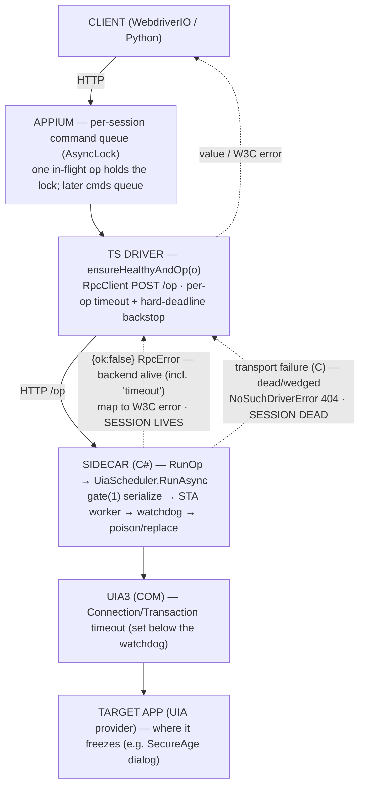

# Request Flow — one op through every layer

*Architecture · updated 2026-06-04*

> **Layer:** sequence (one operation, end to end). For the high-level container view see
> [architecture overview](./overview.md); for the C# files see [sidecar internals](./sidecar-internals.md).
> **All timeout VALUES live in [stability](./stability.md)** — this page shows the *path*, not the numbers.

This driver is a **TypeScript Appium driver + C# FlaUI sidecar** talking over localhost HTTP/JSON. All UIA
work runs on **one serialized STA worker** inside the sidecar, so a frozen target app (or its UIA provider)
must never wedge the session or the Appium server. The diagram below traces a single op down through every
layer — client → Appium queue → TS driver → RpcClient → sidecar → UiaScheduler → UIA3 → target app — and back.

The annotations marked **C / D / E** are the anti-hang behaviours shipped in beta.15; see
[stability](./stability.md) for what each layer guarantees and the exact deadlines.

## The flow

> **Heartbeat:** parent (Appium) dies → stdin EOF → sidecar self-exits (no orphan).
> **Idle guard (E):** no `/op` or `/session` for `idleTimeout` → self-exits (bounds orphans).
> Exact deadlines and the exception→W3C map: [stability](./stability.md) · [rpc-protocol](../03-reference/rpc-protocol.md).

## Reading the flow

- **Down the stack** each layer hands work to a narrower, less-trusted one; the deadline tightens as you
  descend (UIA < watchdog < RPC < hard-deadline — see [stability](./stability.md)). The innermost layer that
  can fail gracefully fires first; the outer layers are backstops.
- **One op holds the per-session lock.** Until the op settles (value, `RpcError`, or a transport failure), the
  Appium `AsyncLock` is held and later commands queue. This is why a never-settling op is the core hazard the
  anti-hang design exists to prevent.
- **Two kinds of failure come back up.** An `{ok:false}` **RpcError** envelope means the backend is alive and
  answered (including its own `"timeout"`) → mapped to a W3C error, session survives. A **non-RpcError**
  transport failure means the sidecar is dead/wedged → C fails the session honestly (`NoSuchDriverError`).
- **Heartbeat & idle guard** are independent of the op path: the stdin-EOF heartbeat kills the sidecar the
  instant Appium dies, and the idle timer (E) reaps a sidecar whose session was forgotten or SIGKILLed.

## Reference

- Code: `lib/driver.ts` (`op` / `ensureHealthyAndOp`), `lib/backend/rpc-client.ts` (per-op timeout +
  hard-deadline), `lib/backend/sidecar.ts` (exit tracking), `sidecar/UiaScheduler.cs`, `sidecar/Program.cs`.
- Timeout values and failure modes: [stability](./stability.md). Open gaps: [known issues](../04-design/known-issues.md).
